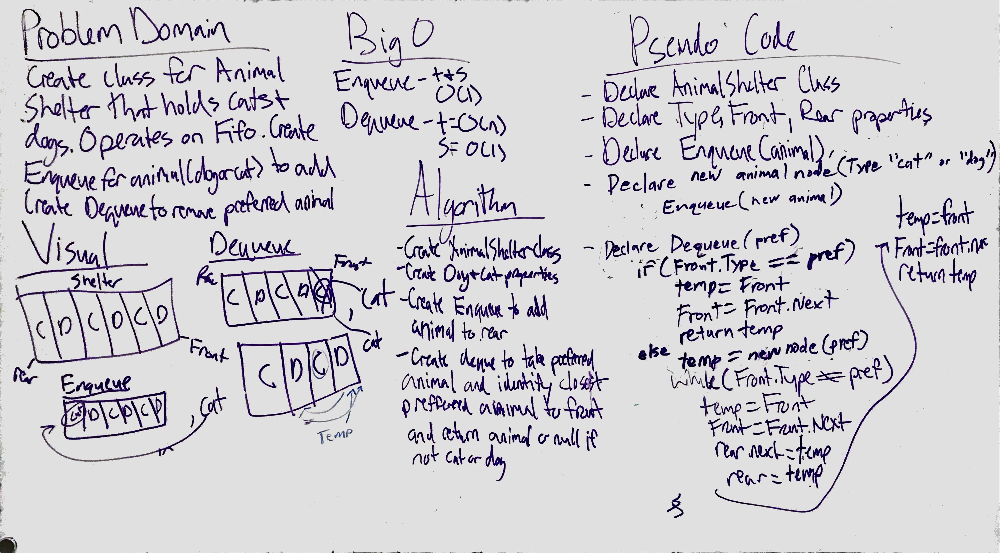

# First-in, First out Animal Shelter.
Create a class called AnimalShelter which holds only dogs and cats. The shelter operates using a first-in, first-out approach.

## Challenge
Implement the following methods:
enqueue(animal): adds animal to the shelter. animal can be either a dog or a cat object.
dequeue(pref): returns either a dog or a cat. If pref is not "dog" or "cat" then return null.

## Approach & Efficiency
The BigO time and efficiency of this whiteboard is:  
Enqueue Time/Space: O(1) 
DeQueue Time: O(n) Space: O(1) 

## Solution

