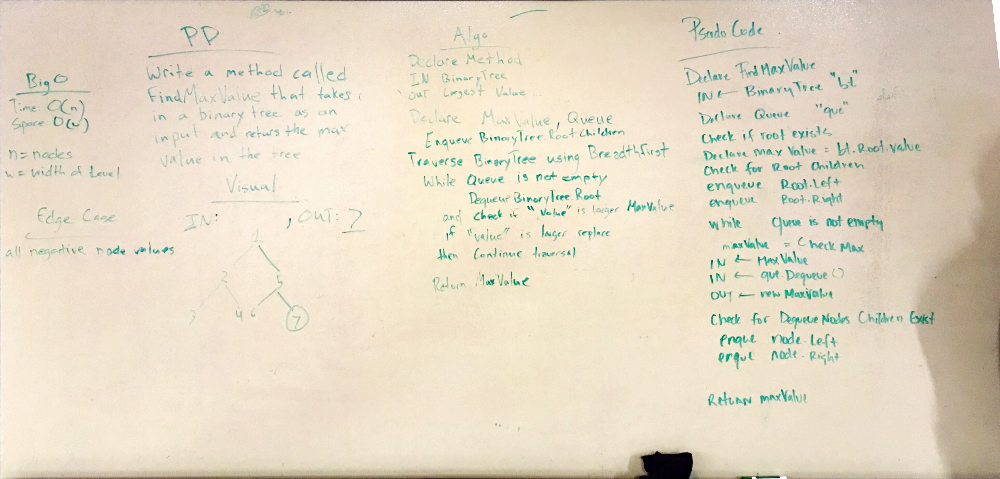

# Find the Maximum Value in a Binary Tree

## Challenge
Write a function called find-maximum-value which takes binary tree as its only input. Return the maximum value stored in the tree. You can assume that the values stored in the Binary Tree will be numeric.

## Approach & Efficiency
Time: O(n) n = node 
Space: O(w) w = width of level  

## Solution

