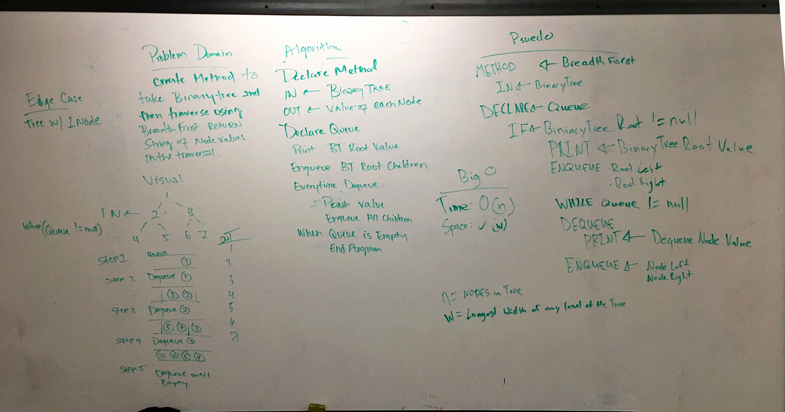

# Breadth-first

## Challenge
Write a breadth first traversal method which takes a Binary Tree as its unique input. Traverse the input tree using a Breadth-first approach; print every visited node’s value.

## Approach & Efficiency
Time: 0(n) 
Space: 0(w) Longests width of any level of the tree.

## Solution
