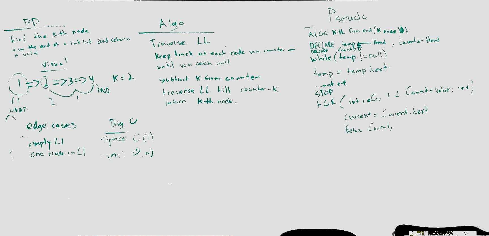

# kth from the end of a Linked List

## Challenge
Finds the Kth node from the end of end a linked list and returns the kth nodes value.

## Approach & Efficiency
Time: O(n)
Space: O(1)

## Solution

