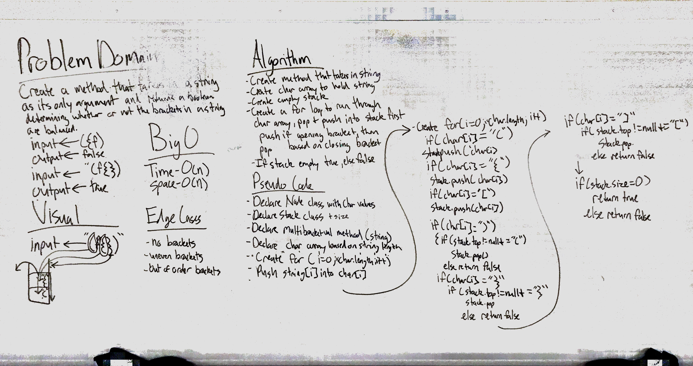

## Multi Bracket Validation
## Challenge
Your function should take a string as its only argument, and should return a boolean representing whether or not the brackets in the string are balanced. There are 3 types of brackets:

Round Brackets : ()  
Square Brackets : []  
Curly Brackets : {}  

## Solution 

### Big 0
Time: O(n) 
Space: O(n) 
