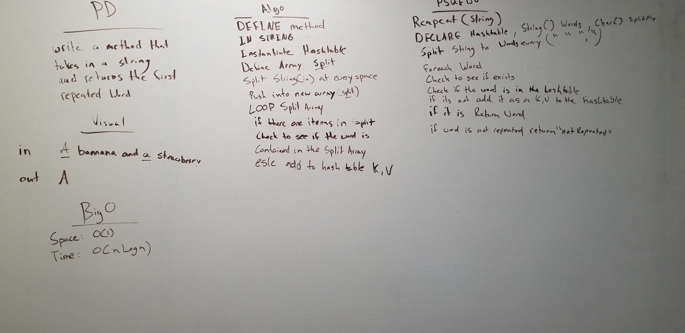

# First repeated word
Write a function that accepts a lengthy string parameter.
Without utilizing any of the built-in library methods available to your language, return the first word to occur more than once in that provided string.

## Challenge

Input: "Once upon a time, there was a brave princess who..."	 
Output: "a"  

## Approach & Efficiency
Big O 
Time: O(1) 
Space: O(nLogn) 

## Solution

