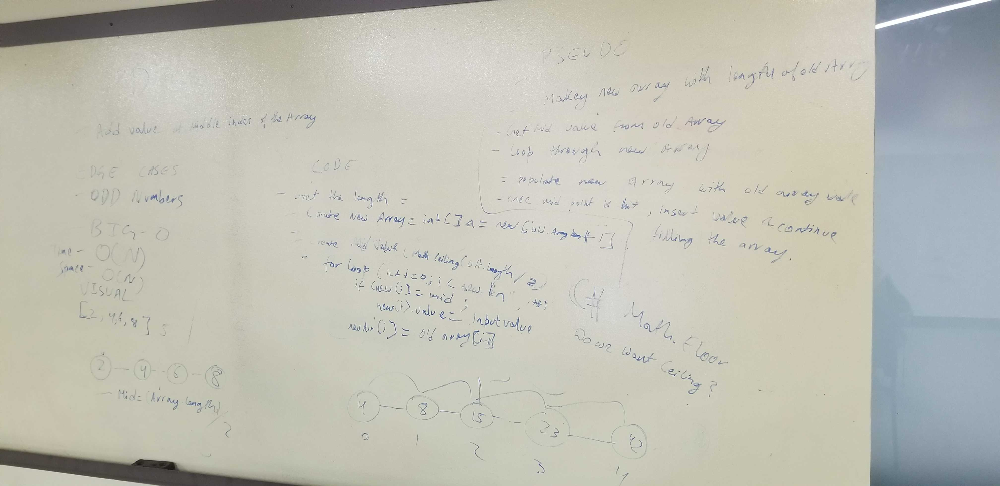

<<<<<<< HEAD
# Data Structures and Algorithms

## Table of Contents
=======
# Insert and Shift an Array

# Challenge
Write a function called insertShiftArray which takes in an array and the value to be added. Without utilizing any of the built-in methods available to your language, return an array with the new value added at the middle index.
>>>>>>> a41f7305b4eadc79b36b00f72ffae4cb45fd3605

1. [Challenge: Insert and shift an array](Challenges/arrayShift)

<<<<<<< HEAD
=======
Example
Input                |   Output
-------------------   ------------------
[2,4,6,8], 5        |  [2,4,5,6,8]
[4,8,15,23,42], 16    | [4,8,15,16,23,42]

## Approach & Efficiency
The BigO is O(n) because we did a for loop, space is O(n).

## Whiteboard

>>>>>>> a41f7305b4eadc79b36b00f72ffae4cb45fd3605
